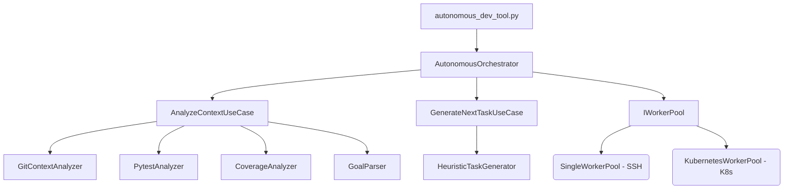
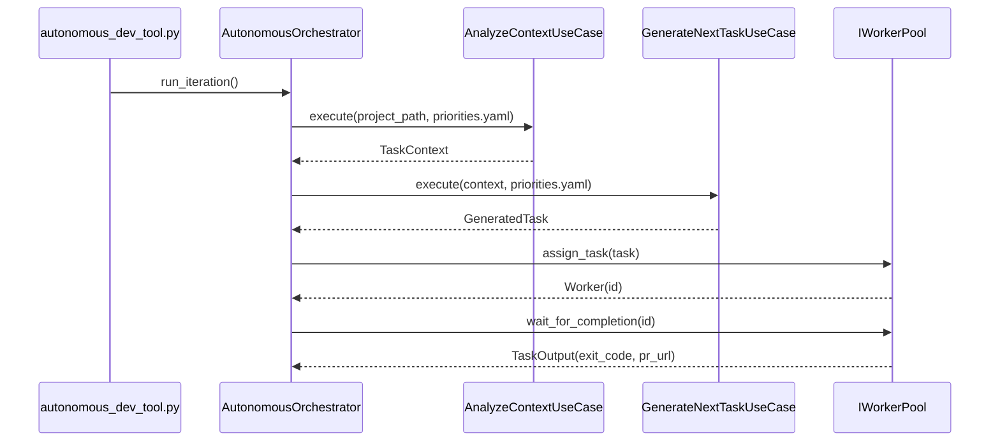

# Autonomous Orchestrator — Production User Guide

A complete guide to the autonomous development orchestrator powering continuous, goal‑directed work. This document explains the architecture, core components, CLI usage, workflows, metrics, and troubleshooting, with references to the exact files in this repository.

---

## Overview

The autonomous orchestrator continuously:
1. Analyzes the current repository context (git, tests, coverage, goals)
2. Generates the next best task using heuristics + goals
3. Executes the task via a worker pool (SSH or K8s)
4. Tracks metrics per iteration

Core entry points:
- Orchestrator: `src/claude_orchestrator/orchestrators/autonomous_orchestrator.py`
- CLI wrapper: `autonomous_dev_tool.py` (run/status/reset)
- Priority goals: `priorities.yaml`

---

## Clean Architecture at a Glance

- Entities (core domain):
  - `src/claude_orchestrator/entities/task_context.py`
  - `src/claude_orchestrator/entities/generated_task.py`
  - `src/claude_orchestrator/entities/worker.py`
- Use Cases (business rules):
  - `src/claude_orchestrator/use_cases/analyze_context_use_case.py`
  - `src/claude_orchestrator/use_cases/generate_next_task_use_case.py`
  - PR Phases (8A/8B/8C): review/validate/integrate use-cases
- Interfaces (ports):
  - `src/claude_orchestrator/interfaces/context_analyzer.py`
  - `src/claude_orchestrator/interfaces/task_generator.py`
  - `src/claude_orchestrator/interfaces/worker_pool.py`
- Adapters (implementations):
  - Analyzers: git/pytest/coverage/goal
  - Generators: heuristic
  - Worker pools: single-worker SSH, Kubernetes

### Architecture Diagram


---

## Components

### Phase 7: Context Analysis + Task Generation
- Context analysis use-case: `src/claude_orchestrator/use_cases/analyze_context_use_case.py`
- Task generation use-case: `src/claude_orchestrator/use_cases/generate_next_task_use_case.py`
- Adapters used:
  - `src/claude_orchestrator/adapters/git_context_analyzer.py`
  - `src/claude_orchestrator/adapters/pytest_analyzer.py`
  - `src/claude_orchestrator/adapters/coverage_analyzer.py`
  - `src/claude_orchestrator/adapters/goal_parser.py`
  - `src/claude_orchestrator/adapters/heuristic_task_generator.py`

Real code excerpt: constructing and running context analysis
```python
from src.claude_orchestrator.adapters.git_context_analyzer import GitContextAnalyzer
from src.claude_orchestrator.adapters.pytest_analyzer import PytestAnalyzer
from src.claude_orchestrator.adapters.coverage_analyzer import CoverageAnalyzer
from src.claude_orchestrator.adapters.goal_parser import GoalParser
from src.claude_orchestrator.use_cases.analyze_context_use_case import AnalyzeContextUseCase

analyze_context = AnalyzeContextUseCase(
    git_analyzer=GitContextAnalyzer(),
    test_analyzer=PytestAnalyzer(),
    coverage_analyzer=CoverageAnalyzer(),
    goal_parser=GoalParser(),
)
context = analyze_context.execute(project_path=".", priorities_file="priorities.yaml", run_tests=False, run_coverage=False)
```

Generate the next task
```python
from src.claude_orchestrator.adapters.heuristic_task_generator import HeuristicTaskGenerator
from src.claude_orchestrator.use_cases.generate_next_task_use_case import GenerateNextTaskUseCase

generate_task = GenerateNextTaskUseCase(
    task_generator=HeuristicTaskGenerator(),
    goal_parser=GoalParser(),
)
next_task = generate_task.execute(context=context, priorities_file="priorities.yaml")
print(next_task.instruction)
```

### Phase 8A: AI Code Review
- Use case: `src/claude_orchestrator/use_cases/review_pr_use_case.py`
- Adapter: `src/claude_orchestrator/adapters/auggie_pr_reviewer.py` (multi‑model GPT‑5 + Claude 4.5)

### Phase 8B: PR Validation (tests/coverage/conflicts)
- Use case: `src/claude_orchestrator/use_cases/validate_pr_use_case.py`
- Adapters: `coverage_pr_validator.py`, `test_pr_validator.py`, `conflict_pr_validator.py`

### Phase 8C: PR Integration (auto‑merge w/ gates)
- Use case: `src/claude_orchestrator/use_cases/integrate_pr_use_case.py`
- Adapter: `src/claude_orchestrator/adapters/github_pr_integrator.py`

---

## Orchestrator Loop

File: `src/claude_orchestrator/orchestrators/autonomous_orchestrator.py`

```python
from src.claude_orchestrator.orchestrators.autonomous_orchestrator import AutonomousOrchestrator

orchestrator = AutonomousOrchestrator(
    worker_pool=SingleWorkerPool(...),
    analyze_context=analyze_context,
    generate_task=generate_task,
    project_path=".",
    priorities_file="priorities.yaml",
)

# Single iteration
orchestrator.run_iteration(run_tests=False, run_coverage=False)

# N iterations
orchestrator.run_iterations(count=5)

# Continuous loop
orchestrator.run_loop(max_iterations=100)
```

Loop diagram


---

## CLI: autonomous_dev_tool.py

CLI wrapper around the orchestrator steps with metrics persistence.

File: `autonomous_dev_tool.py`

```bash
# Run one iteration, fast mode
python autonomous_dev_tool.py run --mode fast

# Continuous mode (Ctrl+C to stop)
python autonomous_dev_tool.py run --continuous --mode fast

# Run N iterations
python autonomous_dev_tool.py run --iterations 5 --mode thorough

# Show metrics summary
python autonomous_dev_tool.py status

# Reset metrics
python autonomous_dev_tool.py reset
```

Modes:
- fast: tests=false, coverage=false
- thorough: tests=true, coverage=false
- full: tests=true, coverage=true (can be slow)

Metrics file: `~/.ui-cli/autonomous_metrics.json`

---

## SSH Worker Setup (SYD2 example)

Adapter: `src/claude_orchestrator/adapters/single_worker_pool.py`

Environment defaults used by CLI (override via flags):
- `AUTONOMOUS_SSH_HOST` (default in code): `root@208.87.135.78`
- `AUTONOMOUS_WORKING_DIR` (default in code): `/root`
- `AUTONOMOUS_MODEL` (default in code): `sonnet4`

```python
from src.claude_orchestrator.entities.worker import WorkerPoolConfig
from src.claude_orchestrator.adapters.single_worker_pool import SingleWorkerPool

cfg = WorkerPoolConfig(pool_type="ssh", max_workers=1, ssh_host="root@208.87.135.78", working_dir="/root", model_name="sonnet4")
pool = SingleWorkerPool(cfg)
```

---

## Integration with priorities.yaml

File: `priorities.yaml` drives goals. Parsed by `GoalParser` and used by `GenerateNextTaskUseCase`.

```yaml
priorities:
  - id: "documentation_updates"
    title: "Update Documentation for DSL Workflows + Priority System"
    status: "open"
    priority: "low"
    workflow: "workflows/documentation_update.ct"
```

How selection works (see `generate_next_task_use_case.py`):
- If `target_goal_id` provided → pick that goal
- Else pick highest priority by `min(goals, key=lambda g: g.priority)` (P0 < P1 < P2 < P3 lexicographically)

---

## Workflow Examples

- Single iteration: analyze → generate → execute
- Continuous mode: add `--continuous` in CLI to loop
- Interpreting metrics (from `autonomous_metrics.json`):
  - success_rate, avg_duration_by_mode, tasks_by_goal, tasks_by_priority

---

## Troubleshooting

- Coverage bottleneck: enable `--mode fast` (sets `run_coverage=False`) for speed
- SSH connectivity: verify host/key, try `ssh <host> "echo ok"`
- Timeouts: increase `--iterations` spacing or worker timeouts
- Git repo required: context analyzer expects a valid `.git` directory

---

## Production Readiness

- Validated in real usage; see `priorities.yaml` completed items (P1.1, P1.2, P1.3)
- Architecture follows Clean Architecture + SOLID
- Can run continuously in a containerized worker or via K8s worker pool

